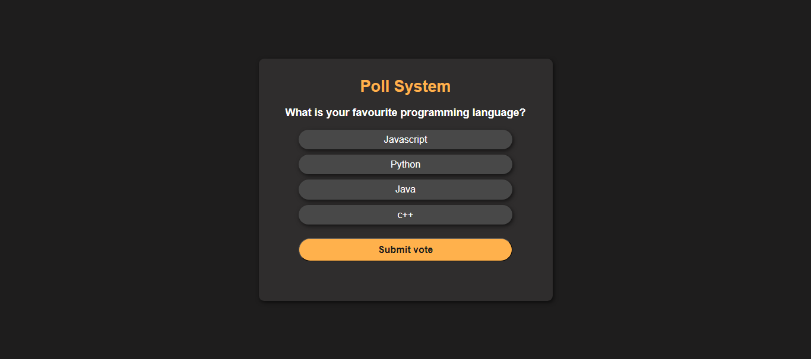
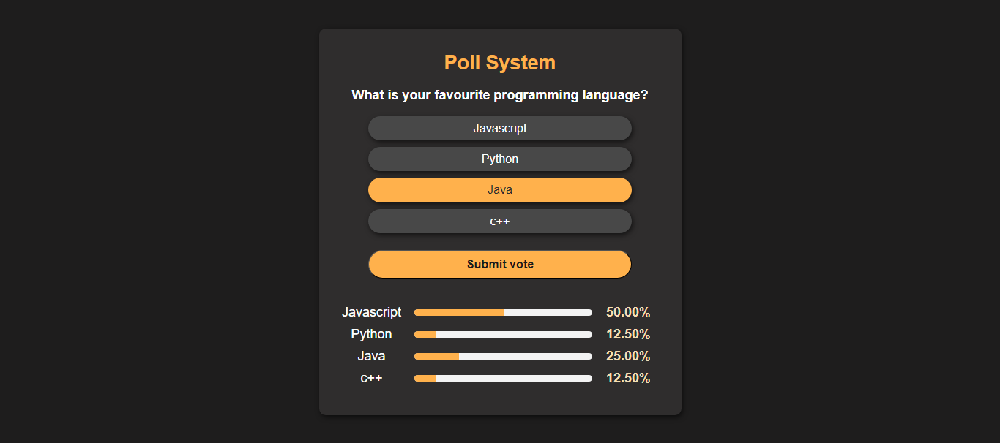
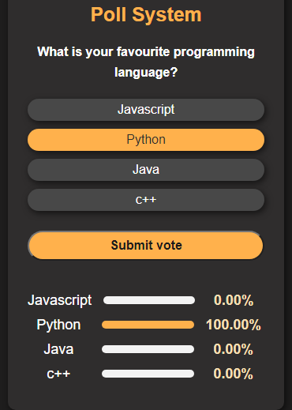

#  Polling System

## Features

- User-Friendly Interface: The project provides a clean 
  for users to select their preferred poll option.

- Real-time Result Display: The poll results are displayed in real-time, utilizing a bar graph to visually represent the percentage of votes for each option.

- Responsive Design: The interface is designed to be responsive, ensuring a seamless experience across various devices and screen sizes.

- live demo : [https://naglaa99.github.io/polling-system/]
